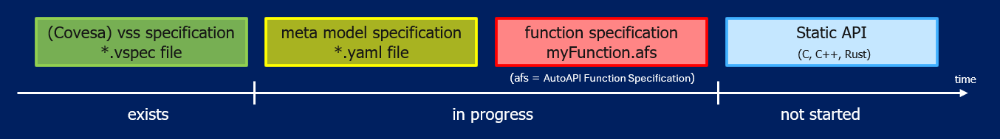

..
   # *******************************************************************************
   # Copyright (c) 2026 Contributors to the Eclipse Foundation
   #
   # See the NOTICE file(s) distributed with this work for additional
   # information regarding copyright ownership.
   #
   # This program and the accompanying materials are made available under the
   # terms of the Apache License Version 2.0 which is available at
   # https://www.apache.org/licenses/LICENSE-2.0
   #
   # SPDX-License-Identifier: Apache-2.0
   #
   # Contributors:
   #   Thomas Pfleiderer - Meta model added
   # *******************************************************************************

Current status of the project

   
Meta Model
==========  

A signal definition is characterized by a set of attributes and parameters. Attributes describe the signal itself (e.g., its properties and characteristics), 
while parameters provide additional configuration and implementation-specific information. Together, they define all information required for API generation and integration.

Enum Type Description
---------------------

The enum types are used for signal attributes and parameters and described there, except **FunctionResult**. **FunctionResult** is the return type of the trigger function of the vehicle function.
Depending on the status the middleware can trigger the required actions.

Data Type Description
---------------------

**Standard Naming / Path Convention:** ``Vehicle.<Domain>.<Signal>``

.. table::  Meta Model Data Type: 

   +-------------------+----------+----------------------------------------------------------------+------------------------------------------------------------------------------------+----------------------------+--------------+
   | **Property /      | **Req.** | **Description**                                                | **Reason for                                                                       | **Example / Notes**        | **Covered by |
   | Attribute**       |          |                                                                | considering it**                                                                   |                            | COVESA VSS** |
   +-------------------+----------+----------------------------------------------------------------+------------------------------------------------------------------------------------+----------------------------+--------------+
   | name              | Yes      | Unique interface or node name.                                 | Needed for generated API identifiers, documentation, and traceability.             | Vehicle.Speed              | yes          |
   +-------------------+----------+----------------------------------------------------------------+------------------------------------------------------------------------------------+----------------------------+--------------+
   | path              | Yes      | Canonical VSS path of the data interface.                      | Allows stable addressing, path-based subscriptions, and standard API generation.   | Vehicle.Speed              | yes          |
   +-------------------+----------+----------------------------------------------------------------+------------------------------------------------------------------------------------+----------------------------+--------------+
   | dataType          | Yes      | Type of the value transported by the interface.                | Required for schema generation, validation, and language bindings.                 | float, uint8, boolean      | yes          |
   +-------------------+----------+----------------------------------------------------------------+------------------------------------------------------------------------------------+----------------------------+--------------+
   | description       | Yes      | Functional meaning of the signal.                              | Prevents ambiguous interpretation across suppliers, functions, and applications.   | Vehicle longitudinal speed | yes          |
   +-------------------+----------+----------------------------------------------------------------+------------------------------------------------------------------------------------+----------------------------+--------------+
   | unit              | Yes      | Engineering unit of the signal.                                | Essential for safe interpretation, comparison, and conversion.                     | "km/h (SI preferred)"      | yes          |
   +-------------------+----------+----------------------------------------------------------------+------------------------------------------------------------------------------------+----------------------------+--------------+
   | min               | Yes      | Engineering minimum representable value.                       | Helps bound legal encoding and generated validation checks.                        | 0                          | yes          |
   +-------------------+----------+----------------------------------------------------------------+------------------------------------------------------------------------------------+----------------------------+--------------+
   | max               | Yes      | Engineering maximum representable value.                       | Helps bound legal encoding and generated validation checks.                        | 300                        | yes          |
   +-------------------+----------+----------------------------------------------------------------+------------------------------------------------------------------------------------+----------------------------+--------------+
   | defaultValue      | Yes      | Default or initialization value if defined.                    | Useful for initialization, simulation, and fallback behavior.                      | 0                          | No           |
   +-------------------+----------+----------------------------------------------------------------+------------------------------------------------------------------------------------+----------------------------+--------------+
   | resolution        | Yes      | Smallest measurable quantization value. Meant for scaling etc. | Important for scaling, display, and control interpretation.                        | 0.1                        | No           |
   +-------------------+----------+----------------------------------------------------------------+------------------------------------------------------------------------------------+----------------------------+--------------+
   | precision         | Yes      | Number of meaningful digits or precision of value.             | Useful for UI formatting and downstream numeric interpretation.                    | 0.01                       | No           |
   +-------------------+----------+----------------------------------------------------------------+------------------------------------------------------------------------------------+----------------------------+--------------+
   | ASIL              | Yes      | ASIL classification when the data is safety-relevant.          | Safety-relevant data must preserve safety classification for downstream design,    | QM / A / B / C / D         | No           |
   |                   |          |                                                                | verification, and decomposition.                                                   |                            |              |
   +-------------------+----------+----------------------------------------------------------------+------------------------------------------------------------------------------------+----------------------------+--------------+
   | minUpdatePeriodMs | Yes      | Minimum interval between updates.                              | Prevents uncontrolled publication rates and helps scheduling analysis.             | 10                         | No           |
   +-------------------+----------+----------------------------------------------------------------+------------------------------------------------------------------------------------+----------------------------+--------------+
   | qualityCode       | Yes      | Runtime quality status of the value.  [1]_                     | Applications need qualifier information, not only the raw value.                   | Invalid / Valid  / & more  | No           |
   +-------------------+----------+----------------------------------------------------------------+------------------------------------------------------------------------------------+----------------------------+--------------+
   | accuracy          | Yes      | Expected measurement or estimation accuracy.                   | Important for control, fusion, analytics, and UI confidence.                       | ±0.2 km/h                  | No           |
   +-------------------+----------+----------------------------------------------------------------+------------------------------------------------------------------------------------+----------------------------+--------------+

.. [1] **Remark:** It is not a static info and hence shall be transformed into a separate signal as it gets updated runtime e.g., Vehicle.Speed.Value -> For signal value and Vehicle.Speed.Qualifier -> For quality code

Parameter Type Description
--------------------------

**Standard Naming / Path Convention:** ``Vehicle.<Domain>.<Parameter>``

.. table::  Meta Model Parameter Type: 

   +--------------+----------+---------------------------------------+----------------------------------------------------------------------------------+-----------------------------+--------------+
   | **Property / | **Req.** | **Description**                       | **Reason for considering it**                                                    | **Example / Notes**         | **Covered by |
   | Attribute**  |          |                                       |                                                                                  |                             | COVESA VSS** |
   +--------------+----------+---------------------------------------+----------------------------------------------------------------------------------+-----------------------------+--------------+
   | name         | Yes      | Unique parameter name.                | Needed for API generation and calibration tooling.                               | Vehicle.Brake.Gain          | yes          |
   +--------------+----------+---------------------------------------+----------------------------------------------------------------------------------+-----------------------------+--------------+
   | path         | Yes      | Canonical VSS path of the parameter.  | Supports standard access and path-based tooling.                                 | Vehicle.Brake.Gain          | yes          |
   +--------------+----------+---------------------------------------+----------------------------------------------------------------------------------+-----------------------------+--------------+
   | dataType     | Yes      | Type of parameter value.              | Required for validation and calibration tooling.                                 | float                       | yes          |
   +--------------+----------+---------------------------------------+----------------------------------------------------------------------------------+-----------------------------+--------------+
   | defaultValue | Yes      | Default parameter value.              | Defines initialization and reset baseline.                                       | 1.0                         | yes          |
   +--------------+----------+---------------------------------------+----------------------------------------------------------------------------------+-----------------------------+--------------+
   | description  | Yes      | Meaning and usage of the parameter.   | Avoids misuse during tuning and service operations.                              | Gain for brake pressure map | yes          |
   +--------------+----------+---------------------------------------+----------------------------------------------------------------------------------+-----------------------------+--------------+
   | unit         | Yes      | Engineering unit if numeric.          | Required for safe interpretation of tunable values.                              | bar                         | yes          |
   +--------------+----------+---------------------------------------+----------------------------------------------------------------------------------+-----------------------------+--------------+
   | protection   | Yes      | Type of the signal protection between | Protection defines the signal protection mechanism used between vehicle function | none / complement           | No           |
   |              |          | application and function adapter.     | and middleware. Either the value and its complement are transmitted together or  |                             |              |
   |              |          |                                       | the value and complement are transmitted through separate signals or API calls.  |                             |              |
   +--------------+----------+---------------------------------------+----------------------------------------------------------------------------------+-----------------------------+--------------+
   | direction    | Yes      | Defines if the signal is either an    | Required for the function descriüption                                           | input / output              | No           |
   |              |          | input or an output signal.            |                                                                                  |                             |              |
   +--------------+----------+---------------------------------------+----------------------------------------------------------------------------------+-----------------------------+--------------+

Scheduling Type Description
---------------------------

**Standard Naming / Path Convention:** ``<FunctionName>.Init/.Step/.Terminate``

.. table::  Meta Model Scheduling Type: 

   +---------------------+----------+------------------------------------------------------------+---------------------------------------------------------------+----------------------------------+--------------+
   | **Property /        | **Req.** | **Description**                                            | **Reason for considering it**                                 | **Example / Notes**              | **Covered by |
   | Attribute**         |          |                                                            |                                                               |                                  | COVESA VSS** |
   +---------------------+----------+------------------------------------------------------------+---------------------------------------------------------------+----------------------------------+--------------+
   | functionName        | Yes      | Runnable or callable function name.                        | Defines execution contract and generated lifecycle API.       | WheelSpeedCalculation            | No [2]_      |
   +---------------------+----------+------------------------------------------------------------+---------------------------------------------------------------+----------------------------------+--------------+
   | runType             | Yes      | Activation type of the runnable.                           | Needed for executable contract generation.                    | init / cyclic / event/ terminate | No [2]_      |
   +---------------------+----------+------------------------------------------------------------+---------------------------------------------------------------+----------------------------------+--------------+
   | description         | Yes      | Purpose of the runnable.                                   | Documents execution intent.                                   | Main cyclic calculation          | No [2]_      |
   +---------------------+----------+------------------------------------------------------------+---------------------------------------------------------------+----------------------------------+--------------+
   | cycleTimeMs         | Yes      | Runnable periodicity.                                      | Needed for integration, scheduling, and watchdog supervision. | 10                               | No [2]_      |
   +---------------------+----------+------------------------------------------------------------+---------------------------------------------------------------+----------------------------------+--------------+
   | previousRunnableRef | Yes      | Runnable that shall precede this execution.                | Useful for ordering constraints.                              |  SensorFusion.Step               | No [2]_      |
   +---------------------+----------+------------------------------------------------------------+---------------------------------------------------------------+----------------------------------+--------------+
   | ASIL                | Yes      | ASIL classification when the scheduler is safety-relevant. | Safety-relevant data must preserve safety classification for  | QM / A / B / C / D               | No           |
   |                     |          |                                                            | downstream design, verification, and decomposition.           |                                  |              |
   +---------------------+----------+------------------------------------------------------------+---------------------------------------------------------------+----------------------------------+--------------+

.. [2] Probably not applicable to be defined as a generic catalogue

Meta Model File
---------------

Version 0.3.0

.. literalinclude:: autoapiframework_metadata_V03.yaml
   :language: yaml
   :linenos:

History
--------

.. table::  Meta Model History: 

   +-------------+-------------------+----------------------------------------------------------+------------------------+
   | **Version** | **Author**        | **Description of Changes**                               |  **Impact**            |
   +-------------+-------------------+----------------------------------------------------------+------------------------+
   | 0.2.0       | Gundlapalli Saran | First release of Meta Model specification                | Baseline               |
   +-------------+-------------------+----------------------------------------------------------+------------------------+
   | 0.3.0       | Thomas Pfleiderer | Signal protection attribute, Function result enum, Typos | Functional enhancement |
   +-------------+-------------------+----------------------------------------------------------+------------------------+

Examples
--------

Example function specifications based on this meta model:

- :download:`SpeedHazardDetection (single cyclic runnable) <examples/speed_hazard_detection.afs.yaml>`
- :download:`VehicleSpeedFusion (multi-rate cyclic runnables at 10 ms and 20 ms) <examples/vehicle_speed_fusion_multirate.afs.yaml>`
