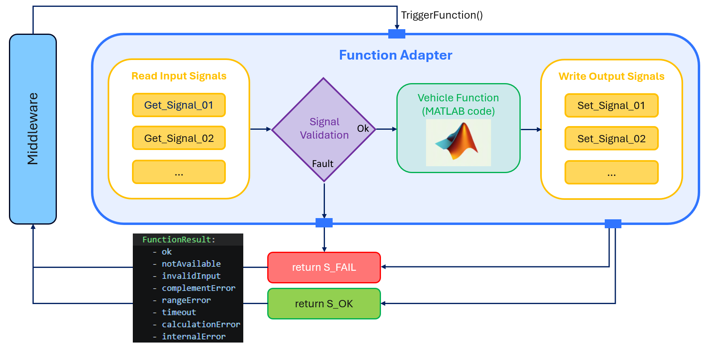
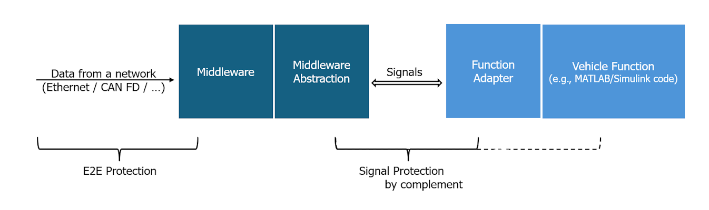
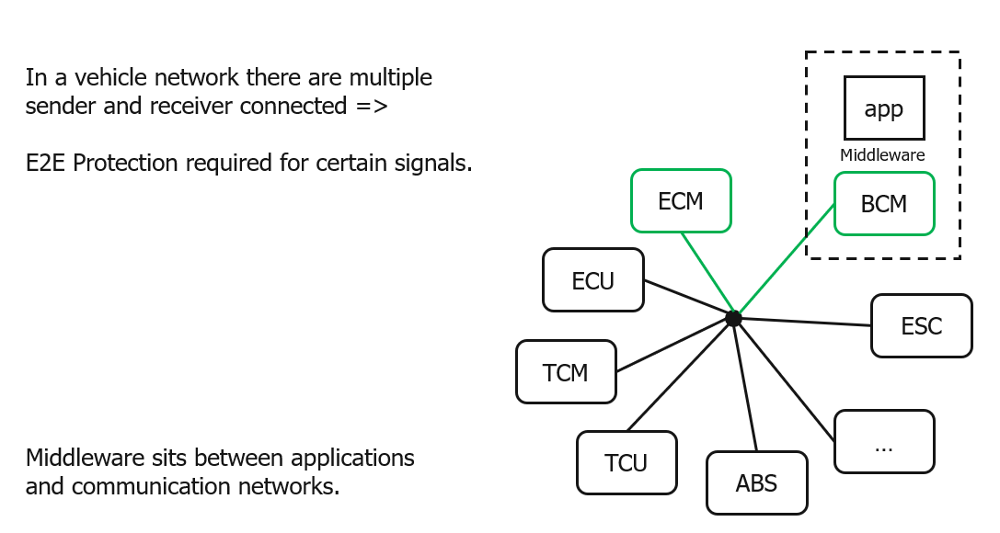
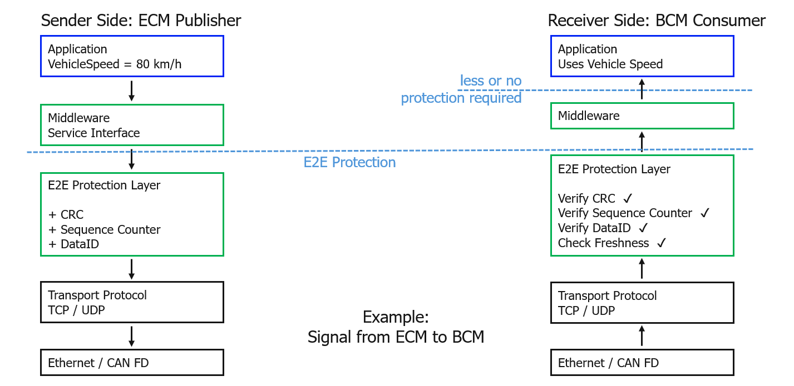

..
   # *******************************************************************************
   # Copyright (c) 2026 Contributors to the Eclipse Foundation
   #
   # See the NOTICE file(s) distributed with this work for additional
   # information regarding copyright ownership.
   #
   # This program and the accompanying materials are made available under the
   # terms of the Apache License Version 2.0 which is available at
   # https://www.apache.org/licenses/LICENSE-2.0
   #
   # SPDX-License-Identifier: Apache-2.0
   #
   # Contributors:
   #   Thomas Pfleiderer - Meta model added
   # *******************************************************************************
   
Function Adapter
================

Overview and Purpose
--------------------

The ``Function Adapter`` is a critical abstraction layer that bridges vehicle functions with underlying middleware platforms. 
It serves as a standardized wrapper that enables vehicle functions to be integrated and executed on any middleware without modification.

Key Purposes of the ``Function Adapter``:

1. **Middleware Abstraction**: The ``Function Adapter`` decouples the vehicle function implementation from the specific middleware platform, 
   allowing the same function logic to run on different runtimes and integration targets.

2. **Static API Contract**: It implements the stable, agreed-upon static API contract derived from the meta model. 
   This contract ensures consistent interface definitions, data types, scheduling behavior, and safety semantics across different implementations.

3. **Safety and Integrity**: The ``Function Adapter`` manages safety-critical aspects including:

4. **Portability**: By using the ``Function Adapter`` pattern, vehicle functions become portable artifacts that can be:

5. **Not a Full AUTOSAR Application**: The ``Function Adapter`` is not intended to be a complete replacement for an AUTOSAR Application. It focuses on portable function logic and signal access, while platform-specific capabilities such as middleware integration, lifecycle management, diagnostics, persistence, security, and deployment remain the responsibility of the surrounding runtime environment.
   
The ``Function Adapter`` essentially transforms the abstract specifications defined in the meta model and YAML instances into concrete, 
executable implementations that maintain the agreed contract regardless of the underlying middleware platform.

Thoughts About Signal Protection
--------------------------------

As shown in the following figure, E2E protection is handled by the middleware layer. Since communication between the application and the middleware is local and 
considered less critical, a lightweight supervision mechanism based on a complementary signal is used instead of full E2E protection in order to reduce performance impact.

E2E Protection Layer Explained
------------------------------

The following figures explain why the full E2E Protection is not part of the API.

.. table::  Random / Typical Modules shown in the picture above: 

   +---------------+-------------------------------------------+-----------------------------------------------------+
   | Abbreviation  | Meaning                                   | Function                                            |
   +---------------+-------------------------------------------+-----------------------------------------------------+
   | **ECM**       | Engine Control Module                     | Controls engine operation, fuel injection, ignition |
   +---------------+-------------------------------------------+-----------------------------------------------------+   
   | **BCM**       | Body Control Module                       | Controls doors, windows, lighting, central locking  |
   +---------------+-------------------------------------------+-----------------------------------------------------+   
   | **ESP / ESC** | Electronic Stability Program / Control    | Vehicle stability control                           |
   +---------------+-------------------------------------------+-----------------------------------------------------+   
   | **ECU**       | Electronic Control Unit                   | Generic term for a vehicle controller               |
   +---------------+-------------------------------------------+-----------------------------------------------------+   
   | **TCM**       | Transmission Control Module               | Controls gearbox and gear shifts                    |
   +---------------+-------------------------------------------+-----------------------------------------------------+   
   | **TCU**       | Telematics Control Unit                   | Connectivity, eCall, OTA updates                    |
   +---------------+-------------------------------------------+-----------------------------------------------------+   
   | **ABS**       | Anti-lock Braking System                  | Prevents wheel lock during braking                  |
   +---------------+-------------------------------------------+-----------------------------------------------------+

The following figure shows an example of an E2E protection layer and its typical integrity checks.

