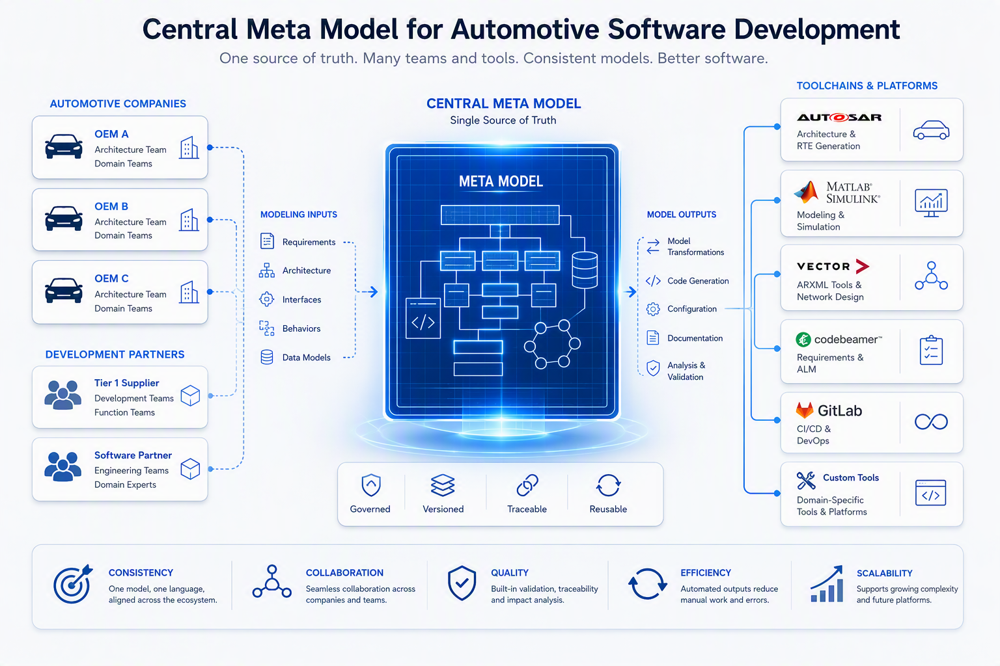
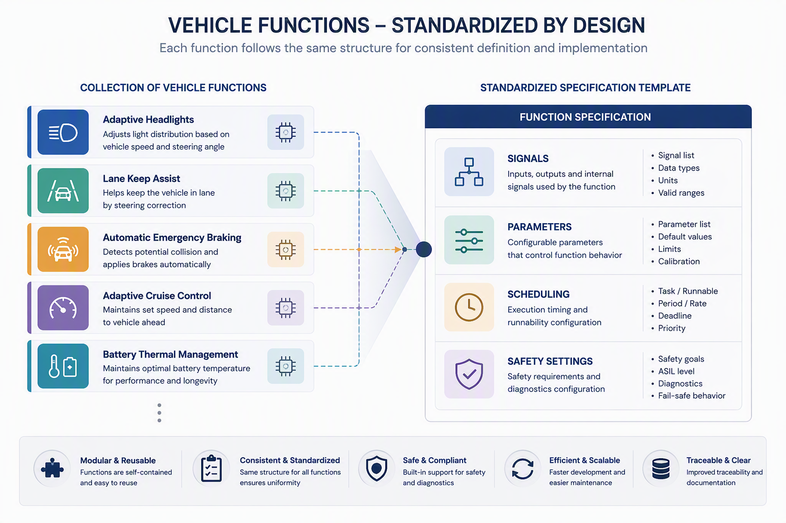
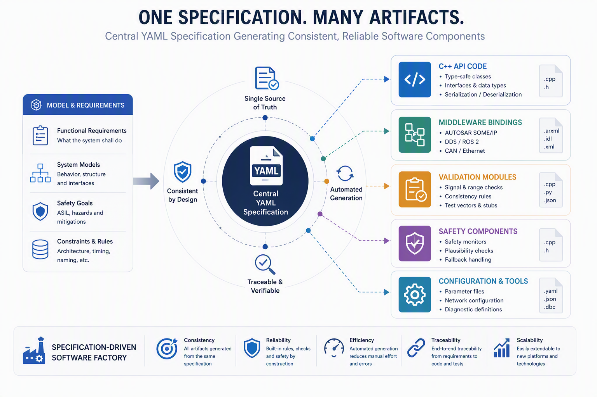
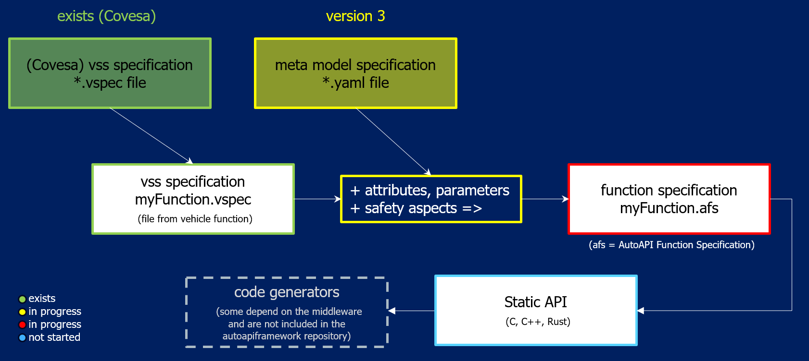

..
   # *******************************************************************************
   # Copyright (c) 2026 Contributors to the Eclipse Foundation
   #
   # See the NOTICE file(s) distributed with this work for additional
   # information regarding copyright ownership.
   #
   # This program and the accompanying materials are made available under the
   # terms of the Apache License Version 2.0 which is available at
   # https://www.apache.org/licenses/LICENSE-2.0
   #
   # SPDX-License-Identifier: Apache-2.0
   #
   # Contributors:
   #   Thomas Pfleiderer - Meta model added
   # *******************************************************************************
   
Purpose of the Meta Model
=========================

Purpose and End-to-End Goal
---------------------------

This project defines a common workflow to integrate vehicle functions on different middleware platforms with a shared technical contract.

The central idea is:

1. Define a common **meta model** (based on COVESA VSS, extended with additional attributes such as safety metadata).

2. Derive a stable, agreed **static API contract** from that meta model.

3. Describe concrete vehicle functions in **YAML model instance files** that follow this contract.
   
4. Use **code generators** to create implementation-specific artifacts for different runtimes and integration targets.

This allows different companies to agree on the same interface definitions and safety semantics (for example ASIL context and E2E protection settings), while
still generating code for their own preferred toolchains and middleware stacks.

Why a Meta Model First?
-----------------------

The meta model is the single source of truth for interface semantics. It defines which properties are mandatory, how data and parameters are structured,
and how execution and safety constraints are represented.

Without this shared model, each team would interpret names, datatypes, quality, scheduling, and safety behavior differently, which leads to integration
friction and unsafe assumptions.

From Meta Model to Static API
-----------------------------

The static API is not handwritten per project. It is systematically derived from the meta model so that all participants share:

- the same signal and parameter naming/path conventions,
  
- the same dataType and unit interpretation,
  
- the same scheduling contract,
  
- the same safety extension contract (including E2E/integrity selections), and
  
- the same traceable structure for validation and review.

In this context, "static" means the interface shape is agreed up front and can be generated consistently across organizations.

Role of YAML Model Instances
----------------------------

Each vehicle function is described as a YAML model instance that conforms to the meta model schema.

These YAML files capture function-specific content such as:

- data interfaces,
  
- calibration parameters,
  
- runnable scheduling information, and
  
- safety extensions (for example fallback behavior and E2E protection profile).

Because all YAML instances follow one shared structure, they can be exchanged, reviewed, versioned, and validated early before implementation details are introduced.

The file extension of these files will be ``*.afs`` (Auto API Framework Specification).

Role of Code Generators
-----------------------

Code generators transform the same YAML model instance into target artifacts, for example:

- static API headers/stubs,
  
- middleware binding code,
  
- validation/serialization code, and
  
- safety supervision and integrity-check scaffolding.

This preserves one logical function definition while enabling multiple technical realizations. As a result, integration effort is reduced,
consistency is improved, and safety-relevant behavior is made explicit and auditable.

What New Members Should Keep in Mind
------------------------------------

- The meta model defines the common language.
  
- The static API is the agreed contract derived from that language.
  
- YAML model instances describe concrete functions using that contract.
  
- Generators produce implementation artifacts without changing the agreed function semantics.

Status Of The Current Project
-----------------------------

Currently we have a Meta Model in place with additional parameters and attributes compared to existing vss definition of COVESA. There are discussions and feedback rounds about additional useful safety aspects to finalize the meta model.

An ``*.afs`` file does not use the VSPEC format. Instead, it is defined in YAML format. It is not specified yet.

